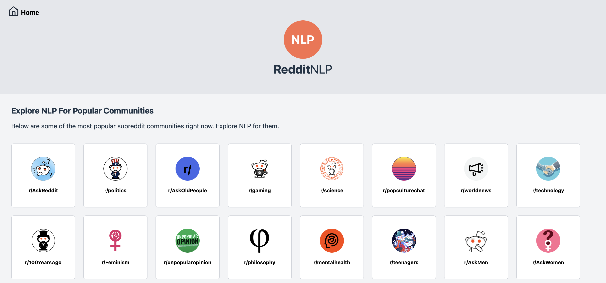

# RedditNLP



## Project Overview

This project aims to provide meaningful insights into Reddit content by:
- Extracting and analyzing named entities from Reddit posts and comments
- Measuring toxicity and positive content scores in discussions
- Visualizing sentiment trends across time

## Architecture

The project is split into two main components:

- **Frontend**: React-based web application for data visualization and user interaction
- **Backend**: Python-based API server handling data processing and analysis

## Quick Start

1. **Backend Setup**:
   ```bash
   cd backend
   python -m venv venv
   source venv/bin/activate  # On Windows: venv\Scripts\activate
   pip install -r requirements/requirements.txt
   cp config/.env.example config/.env
   # Configure your .env file
   python src/main.py
   ```

2. **Frontend Setup**:
   ```bash
   cd frontend
   npm install
   cp .env.example .env
   # Configure your .env file
   npm start
   ```

Visit `http://localhost:5173` to access the application.

## Directory Structure

```
.
├── frontend/             # React frontend application
├── backend/             # Python backend server
├── docs/               # Project documentation
└── README.md           # This file
```

## Documentation

- [Frontend Documentation](frontend/README.md)
- [Backend Documentation](backend/README.md)
- Additional documentation can be found in the `backend/docs/` directory

## License

This project is licensed under the MIT License - see the LICENSE file for details.

